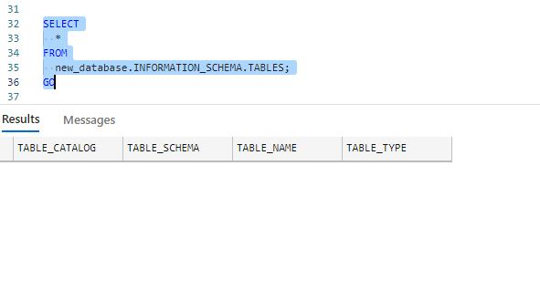

# AUTOMATING EXCEL FILES' INGESTION ON AZURE DATA STUDIO
This helps in automating ingestion of excel files (including csvs &amp; excel) on to Azure Data Studio(SQL-Server).

<h4> Just change the path to your folder that might contain excel files with all other files & the name of database that you want to use. </h4>  

<h4> As the the function that is used to create list of excels ensures that it filters names that are either in (.csv or .xlsx) format. And then transfer the filtered list of files to new folder.</h4>
<h4>Before doing the ingestion, it ensures to convert table & column names in a format which is acceptable as per norms of sql server (tried my best to cover all possible cases that could return error). </h4>
<h4>But, in case say any files whose format still doesn't match the standards then in that case it will not be able to upload it, but it will still continue to proceed ahead as loop is masked by try catch. </h4>

Do give your Feedback, if possible. Thanks.
 

